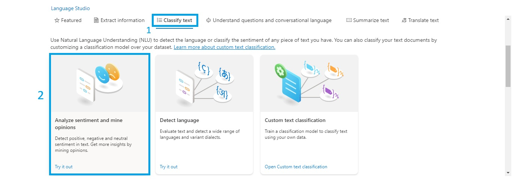
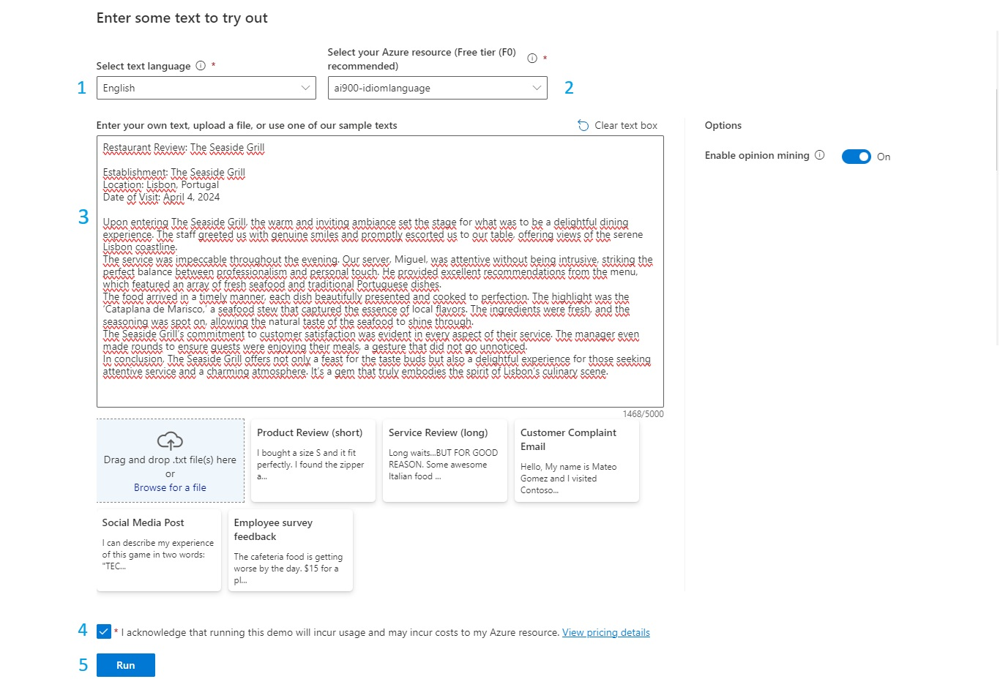
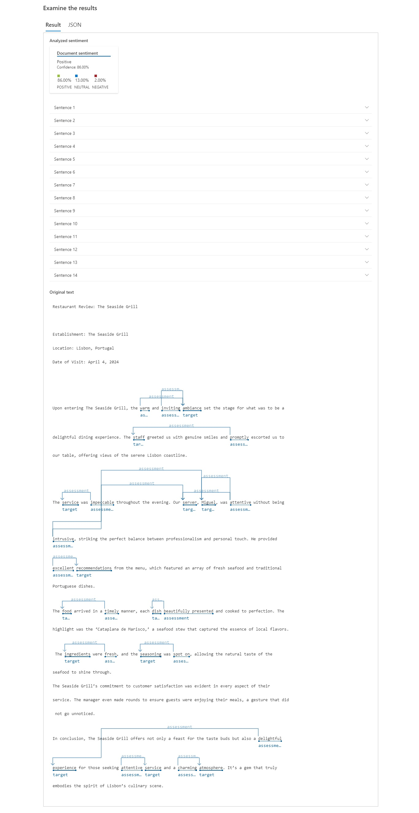

# Desafio: Análise de Sentimentos com o Language Studio no Azure AI

## ℹ️ Sobre:

O objetivo deste desafio é realizar uma `análise de texto` utilizando a `Azure AI` para extração de informações como o sentimento, frases-chave e Entidades, dentro de um idioma padrão.

## ✅ Passos realizados:

> [!IMPORTANT]
>
> - [x] Ter um cadastro na [Azure](https://azure.microsoft.com) - realize o login na plataforma;
>   1. No `MENU`, localizar o link `+ Create a resource`, em `Categories`, selecionar `AI + Machine Learning` e, por fim, clicar em `Language Service` e `create`.
>   2. Na página que foi carregada, clique no botão `Continue to create your resource`; 
>   3. Preencha as informações: `Resource group` (Selecione um existe ou crie outro), **Instance Details**, setar um `Name`, **Pricing tier**: selecionar `Free FO (5K Transactions per 30 days)` e deixe o campo "**By checking this box I acknowledge that I have read and understood all the terms below**" checado [x];
>   4. Clique no botão `Review + Create` e, por fim, em `create`.
> - [x] Com o recurso criado/deploy finalizado, acessar o portal [Serviço cognitivo do Azure](https://language.cognitive.azure.com/?azure-portal=true) para realizar os testes no recurso criado - **Necessário realizar o login e selecionar o nome recurso criado acima** - clique em `Done`.
> 

 

> **Dentro do Language Studio**:

<!--
* **Dentro do Language Studio** crie um novo recurso seguindo a ordem indicada na imagem abaixo:

-->

* Siga os passos abaixo para selecionar a `ferramenta de análise`: Clique nas opções na ordem indicada.

* Preencha as informações com base no teste que deseja realizar:
    1. Idioma do texto;
    2. Verifique se está com o recurso correto selecionado;
    3. Insira o texto no idioma escolhido;
    4. Deixe a opção checada;
    5. Clique em `Run` para executar a análise.

    > Neste caso, estou realizando a `análise da avaliação de um cliente em um restaurante`. Para tanto, desenvolvi um `prompt` e pedi ao `Copilot` para gerar o texto para mim, veja o comando abaixo:

<pre>
    "Elabore um texto avaliativo sobre o atendimento em um restaurante.
    Informe o nome do estabelecimento, localidade, data do atendimento e a avaliação do usuário.
    Utilize o Inglês como idioma padrão."
</pre>

## 🎯 Resultados obtidos

> Você também consegue acessar o resultado em `JSON` clicando [aqui](./outputs/result.json)

Com base na análise de sentimento realizada é possível verificar que `86%` da avaliação foi `positiva`. Ou seja, o cliente teve uma `boa experiência neste restaurante`. Além disso, a análise também destaca as `frases-chave` utilizadas para chegar na conclusão final.

## Conclusão

A **Análise de Sentimentos** no **Azure AI** é uma ferramenta poderosa que utiliza o **Language Studio** para `interpretar emoções em textos`. Com ela, é possível `extrair insights valiosos`, `identificando se os sentimentos expressos são positivos, negativos ou neutros`. Empresas e desenvolvedores podem aproveitar essa capacidade para **aprimorar a experiência do usuário, monitorar feedbacks e refinar serviços**.

## 📖 Referências:

* [Serviços Cognitivos do Azure - Portal](https://speech.microsoft.com/portal)
* [Explore Speech Studio](https://aka.ms/ai900-speech)
* [Analyze text with Language Studio](https://aka.ms/ai900-text-analysis) 
